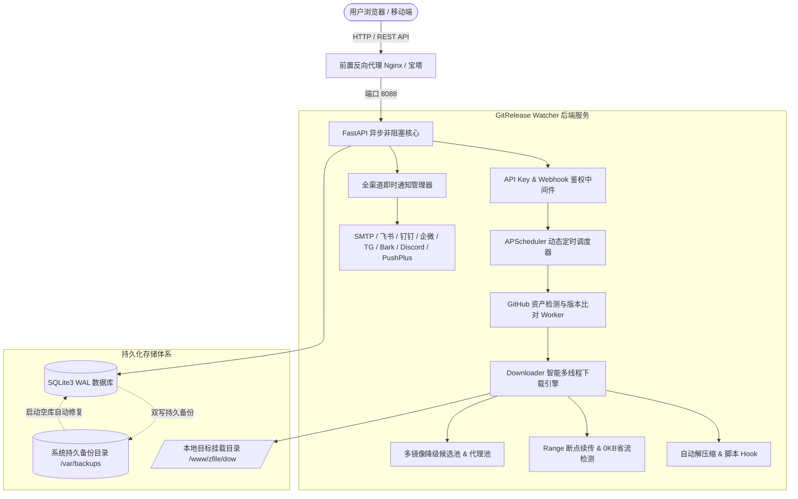

# GitRelease Watcher - 一个用Ai开发的GitHub 软件升级自动监测与智能归档下载器

<p align="center">
  
  
  
  
  
</p>

<p align="center">
  <b>专注于为 Linux 服务器、NAS、软路由及各类跨平台主机提供轻量、高可用、高颜值的 GitHub Release 监控与资产自动化下载管理方案</b><br>
  <i>告别繁琐的手动翻页下载与架构核对，让软件更新在后台静默、安全、可靠地完成。</i>
</p>

---

## 📖 产品概述 (Product Overview)

**GitRelease Watcher** 是由开源极客团队倾力打造的**下一代自动化 GitHub Release 监控与智能下载分发平台**。

无论是部署在家庭 NAS（群晖、绿联、极空间、unRAID）、边缘软路由（OpenWrt、iStoreOS）、树莓派，还是部署在公网 Linux 云服务器，它都能化身为您的专属“软件管家”。您只需添加感兴趣的 GitHub 仓库并定义简单的规则，系统即可在后台**7×24 小时全自动监测上游发布**。一旦检测到新版本，立即通过国内加速通道极速下载指定平台安装包、严格校验哈希完整性、自动解压归档、触发后续安装脚本，并通过邮件、飞书、钉钉、企业微信、Telegram、Bark 等多渠道即时通知您。

---

## 🎯 痛点洞察：为什么选择 GitRelease Watcher？

在日常开发、运维与数字折腾中，我们常常面临以下困扰：

| 传统痛点场景 | 传统手工/脚本方式 | GitRelease Watcher 的解决方案 |
| :--- | :--- | :--- |
| **多开源项目跟踪繁琐** | 手动收藏数十个 GitHub 仓库，频繁肉眼刷新 Release 页面，极其耗时且容易遗漏重要安全更新。 | **全自动无感巡检**：定时并发轮询，支持独立 Cron 或分钟级周期，支持一键全量刷新。 |
| **平台与架构眼花缭乱** | 一个 Release 包含数十个资产（amd64/arm64/win/apk/rpm），手动下载极易挑错架构导致无法运行。 | **智能全平台资产识别引擎**：支持关键词与正则双模式，内置在线测试器与别名推断，100% 准确命中目标。 |
| **国内网络下载频频中断** | 直连 GitHub 下载龟速（几 KB/s），动辄网络超时或连接重置（Connection Reset）。 | **多镜像故障降级池**：内置镜像加速前缀与动态备选线路池，支持 HTTP/SOCKS 代理与 Range 断点续传。 |
| **旧版本堆积塞满磁盘** | 长期下载导致存储目录堆满数百个历史 `.tar.gz` 或 `.zip`，造成宝贵磁盘浪费。 | **智能版本轮换清理 (Retention)**：自主设定保留最近 N 个版本，新包落盘后自动安全淘汰旧包。 |
| **下载后缺少自动化链条** | 下载完后仍需手动 SSH 登录服务器执行解压、授权、重启容器等重复劳动。 | **自动化后处理 Hook**：支持内置解压包 (.tar.gz/.zip) 及自定义 Shell 脚本模板，宏变量注入打通 CI/CD。 |
| **版本升级数据清空风险** | 许多自建工具升级覆盖安装后，原有的监控任务和配置被直接冲掉。 | **独创四重零丢数据与灾难自愈防线**：双写持久备份 + 毫秒级启动自愈，任凭版本覆盖升级数据永不丢失。 |

---

## 🌟 核心特性全景 (Key Features)

### 1. 🖥️ 极客美学现代控制台
- **双模自适应主题**：支持精雕细琢的深色黑客夜间模式（玻璃拟态、高斯模糊、微动效）与纯净白天日间模式（高对比度文字与浅色卡片，适配办公阅读）。
- **4 大精选交互视图**：
  - 🏢 **仓库聚合分组 (`grouped`)**：同一仓库下的全架构多任务卡片式聚合归类，层级分明；
  - 🔲 **平铺网格视图 (`flat`)**：全览卡片式直观布局，运行状态与当前版本一目了然；
  - 📋 **高密度列表视图 (`list`)**：行紧凑设计，专为批量管理数十上百个监控任务打造；
  - ⏱️ **活动时间线视图 (`timeline`)**：按操作日志与更新事件的时间轴串联，历史动态清晰可溯。
- **单行流线型悬浮批量工具栏**：勾选多个任务卡片自动唤起操作栏，支持单次一键全选、批量检测、批量启用/暂停、批量删除及批量修改存储目录。

### 2. 🎯 智能资产过滤与在线测试器
- **关键词与正则表达式双引擎**：输入包含规则（如 `linux, amd64, tar.gz`）与排除规则（如 `sha256, asc, sig`），精准拦截无关附件。
- **在线规则测试器 (Rule Sandbox)**：在新建任务弹窗中，只需点击「测试规则」，系统秒级连通 GitHub 实时拉取最新 Release 资产清单，实时高亮命中目标并展示匹配耗时，杜绝写错规则。
- **全平台识别与专属别名推导**：基于文件名自动推断识别 `Windows x64 便携版`、`Linux AMD64`、`macOS ARM64`、`Android 通用版` 等专属别名，并自动保证多平台任务命名唯一。

### 3. 💾 智能断点续传与 0 KB 省流检测
- **本地已有文件智能识别**：执行下载前，自动探测目标存储目录；若本地已存在同名且体积一致的安装包，**自动判定为已就绪并同步版本号，节省 100% 网络流量**。
- **HTTP Range 断点续传**：遇网络波动或代理意外断开，系统自动保留 `.tmp.part` 临时文件，下次轮询或重试时直接无缝从断点继续拉取，彻底告别大文件重新开始。
- **SHA256 严格哈希校验拦截**：自动抓取伴随发布的 `checksums.txt` 或 `.sha256` 校验清单；可选严格模式，校验哈希不一致时强制隔离并清理损坏包。

### 4. 🚀 国内加速与多线路故障转移 (Failover)
- **多镜像候选池**：内置国内主流 GitHub 镜像加速通道，支持配置备选镜像列表；
- **智能指数退避重试 (Exponential Backoff)**：遇偶发性上游超时或 API 限流错误，自动按 `60s -> 180s -> 300s` 梯度智能退避重试，避免无效高频请求被封禁；
- **个人访问令牌 (GitHub Token) 支持**：配置个人 Token 后，API 查询限流额度由匿名 60 次/小时跃升至 **5,000 次/小时**。

### 5. 🔔 9 大通知渠道全矩阵覆盖
支持在触发「发现新版本」、「下载完成」、「下载失败」及「磁盘警戒」等事件时，向外部即时派发卡片式富文本通知：
- ✉️ **邮件 (SMTP)**：支持各大企业邮与个人邮箱（QQ、网易 163、Gmail 等），带 SSL 加密与精美 HTML 模板；
- 🕊️ **飞书自定义机器人 (Feishu)**：支持 Webhook 及签名安全加签，交互式卡片排版；
- 💬 **钉钉群机器人 (DingTalk)**：支持加签密钥防伪与 Markdown 富文本推送；
- 💼 **企业微信机器人 (WeChat Work)**：一键派送企业微信群聊 Markdown 消息；
- ✈️ **Telegram Bot**：支持专属 Bot Token 与 Chat ID 直推送；
- 📱 **Bark (iOS 即时推送)**：专为 iPhone / iPad 打造的轻量级毫秒送达即时推送；
- 🎮 **Discord Webhook**：支持海外开源社群频道机器人派送；
- 🟢 **PushPlus (微信轻量推送)**：免自建、无需公网服务器，直接将更新送达个人微信；
- 🧪 **单点即时测试**：每个通知卡片均配备独立「测试」按钮，当场验证网络连通性。

### 6. 🗄️ 军工级四重数据零丢失与灾难自愈防线
解决行业内同类项目升级版本时“历史任务清单与计划被覆盖清空”的顽疾：
1. **物理层隔离**：官方打包程序严格排查并绝不携带空白 `.db` 文件，用户解压新版本无物理可能冲掉原数据库；
2. **系统持久双写快照**：任务增删改或配置变更时，自动备份热快照至系统受保护持久目录（Linux: `/var/backups/gitrelease-watcher/`，Windows: `%APPDATA%/`），项目目录即使被彻底误删，数据依然完好；
3. **启动期毫秒级自愈引擎**：数据库启动初始化时，若检测到空库（任务数 = 0），自动在毫秒级全盘扫描系统持久备份并执行无缝回填恢复；
4. **一键快照热备份与还原**：控制台提供完整 SQLite 数据库快照一键下载导出与上传热还原，附带数据校验与调度器自动重载。

### 7. ⚙️ 自动化后置执行 (Shell Hooks & Auto Extract)
- **下载完成后自动解压**：原生支持 `.tar.gz`、`.zip`、`.tar.xz` 等主流归档包自动解压释放，并自动为 Linux 二进制文件赋予 `chmod +x` 可执行权限；
- **自定义 Shell 脚本模板**：支持在下载后执行自定义命令，提供 `tar_extract`、`docker_restart`、`webhook_curl` 快捷宏模板，支持 `$RELEASE_FILEPATH`、`$RELEASE_DIR`、`$TAG`、`$APP_NAME` 等环境变量注入。

### 8. 🛡️ 生产级安全防护与访问控制
- **全局 API Key 鉴权**：开启后全站 API 受密钥保护，采用时间常量比对算法 `hmac.compare_digest` 防御微秒级时序侧信道攻击；
- **专属 Webhook 独立鉴权**：外部 CI/CD 或第三方触发器支持通过单任务独立 `webhook_secret` 触发检测；
- **磁盘容量阈值熔断**：可自定义磁盘可用空间保护红线（如 5 GB），低于安全阈值时自动暂停下载，保护宿主机稳定运行。

---

## 🏗️ 系统技术架构 (Architecture)



- **后端架构**：FastAPI + Python 3.8+ 异步非阻塞事件驱动，兼顾极高的 API 响应速度与极低内存占用（常规运行内存仅约 **30~50 MB**）；
- **数据持久化**：原生 SQLite3 + WAL (Write-Ahead Logging) 模式，无任何外部数据库（MySQL/Redis）依赖，启动即用；
- **前端架构**：原生 Vanilla JavaScript (ES6+) 与极致 CSS3 设计，不依赖复杂笨重的前端构建工具包，加载毫秒直达。

---

## 👥 典型应用场景 (Use Cases)

1. **家庭 NAS 与私有云用户 (群晖 / 绿联 / 极空间 / unRAID / TrueNAS)**
   - 自动跟踪 Clash、v2rayNG、Frp、Syncthing、Alist、DDNS-Go 等常用工具；
   - 自动下载最新安装包并归档至 NAS 的共享文件夹或 ZFile 目录，供局域网全家设备下载安装。
2. **软路由与边缘节点折腾者 (OpenWrt / iStoreOS / 树莓派)**
   - 自动检测并下载最新的固件插件、核心内核二进制，配合 Shell 后置脚本自动解压并赋予执行权限。
3. **Linux 运维工程师与云服务器站长**
   - 追踪云服务器关键服务组件的 Release 发布；
   - 通过 Webhook 与 Docker 容器联动，自动下载新版镜像二进制并自动触发容器滚动重启。
4. **移动办公与多终端极客**
   - 手机端配置 Bark 或 PushPlus 微信通知；
   - 只要 GitHub 软件一发布新版本，手机立刻收到带版本更新日志的即时推送，随时随地掌握软件动态。

---

## ⚡ 极速部署指引 (Quick Start)

### 方式 1：Linux 服务器一键全自动安装 (推荐)

支持 Ubuntu / Debian / CentOS / Rocky Linux / AlmaLinux / Arch 等主流系统：

```bash
# 1. 克隆或上传项目至服务器
git clone https://github.com/your-username/gitrelease-watcher.git /opt/gitrelease-watcher
cd /opt/gitrelease-watcher

# 2. 执行一键安装脚本 (自动配置环境、依赖与 Systemd 开机自启)
sudo bash scripts/install.sh
```
安装完成后，控制台将自动打印面板访问地址：`http://<您的服务器IP>:8088`。

### 方式 2：Docker / Docker Compose 容器化部署

```bash
# 启动容器
docker compose up -d
```
默认挂载 `./data` 进行数据持久化，宿主机下载目录默认为 `/www/zfile/dow`，可通过编辑 `docker-compose.yml` 随意映射至您的 NAS 硬盘路径。

### 方式 3：Windows / 本地免安装运行

双击项目根目录下的 `start.bat`，或在命令行运行：
```bash
pip install -r requirements.txt
python run.py
```
浏览器打开 `http://127.0.0.1:8088` 即可开启体验。

---

## 📚 详细文档导航

为了帮助您深入了解本项目的配置与细节，我们准备了完备的技术文档：
- 📖 [**完整安装部署与运维手册**](docs/INSTALL_AND_USER_GUIDE.md)：涵盖 Systemd 守护进程、Nginx 反向代理、安全组放行、常见排错 FAQ；
- 📑 [**产品规划与设计白皮书**](docs/PRODUCT_PLANNING.md)：包含功能迭代蓝图、性能评测与架构演进；
- 🚀 [**新手 3 分钟极速上手教程**](USER_GUIDE.md)：涵盖 GitHub Token 免费获取、热门软件规则抄作业与通知配置。

---

## 🤝 参与贡献与开源许可

本项目采用 **[MIT License](LICENSE)** 开源许可证。
我们非常欢迎社区开发者提交 Issue、反馈使用建议或发起 Pull Request！

- 如果您觉得本项目对您的数字生活或工作有所帮助，欢迎在 GitHub 上点亮一颗 ⭐️ **Star** 支持作者！
- 如有商业合作或深度定制需求，欢迎通过 Issue 或邮件与核心团队联系。
